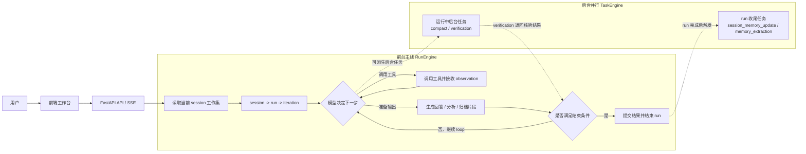

# PaperReader

> 面向论文精读场景的本地优先阅读工作台。它不是一次性摘要器，而是一个围绕 `session` 持久化状态构建的论文阅读运行时。默认以轻量级桌面应用形式运行（原生窗口 + 进程内 FastAPI），也保留浏览器开发模式。

PaperReader 的目标不是“给论文生成一段看起来不错的总结”，而是帮助研究者在同一个会话里持续完成：上传论文、解析原文、生成分析、追问细节、补充相关文献、维护记忆、做高风险核验，并最终沉淀成结构化归档。

## 一、项目定位

很多论文工具的问题并不在于“不会总结”，而在于：

- 只能给出一轮性输出，没法支撑连续追问
- 长对话后上下文会漂移，答案越来越脱离原文
- 找到的外部参考文献无法真正回流到当前阅读工作台
- 读完以后，缺少可复用、可追溯的归档结果
- 后台发生了什么完全不可见，用户无法判断系统是否仍然可信

PaperReader 针对的是这些问题。它把“读论文”建模为一个持续运行的 `session`，而不是一段短暂的聊天记录。

目前仓库已经具备以下核心能力：

- 前台主运行时：统一的 `RunEngine`，支持 `analyze`、`answer`、`archive`
- 流式输出：前端通过 SSE 接收主运行事件，逐步显示模型输出
- 后台专属 Agent：`compact`、`session_memory_update`、`memory_extraction`、`verification`
- 分层记忆：`working memory`、`evidence ledger`、`compact memory`、`library memory`、`verification memory`
- 结构化论文解析：PDF 默认走 `Docling` 标准 pipeline，生成正文、章节、表格、图片区域与可回溯定位信息
- 面向问答的本地检索：解析结果会归一化成 `narrative / table / figure` 三类 chunk，供问答、验证和归档复用
- 高风险问答门禁：方法、实验、数值结论等高风险问题在缺少原文证据时不会直接放行
- 本地优先文件管理：session 内的论文、解析产物、引用、分析、归档、记忆文件统一管理
- 文献补充：支持发现相关文献并本地化到当前 session
- 归档质量提升：`archive` 会直接保留分析结果，同时把问答整理为综合总结，并输出轻量 Markdown 校验警告
- 持久化任务系统：后台任务有状态、有日志、有进度、可停止、刷新后可恢复
- 桌面应用形态：通过 `pywebview` 在系统原生 WebView（Windows 上为 Edge WebView2）中加载前端，进程内启动 FastAPI，单端口、单进程、单窗口，工作流与 `data/` 持久化完全不变
- 前后端测试：覆盖流式事件、任务面板、记忆存储、运行时 API 与测试数据隔离

推荐使用流程:

1. 创建一个新的 session
2. 上传一篇或多篇论文
3. 运行 `Analyze Session`
4. 在同一个 session 中持续追问
5. 如有需要，在右侧发现并本地化相关文献
6. 观察高风险问题是否触发验证
7. 让后台任务完成压缩和记忆维护
8. 最后生成 archive 作为本次阅读沉淀

## 二、系统设计总览



上图只画运行机制本身，不把所有基础设施依赖都塞进图里。图里的重点是：

- 中间这条链路就是主 agent loop，真正的循环发生在 `模型决定下一步 -> 调工具 -> 回到决定`，以及 `准备输出 -> 是否满足结束条件 -> 回到决定`
- 右侧后台任务只分成两类：运行中任务与 run 收尾任务，避免把四个 task 全部拉成长线
- `verification` 属于运行中任务，所以它的结果会回流到“是否满足结束条件”

实际支撑关系是：

- `RunEngine` 和 `TaskEngine` 都会使用 `LLM Client / CLIProxy / Provider`
- 两者都会把状态、事件、记忆和产物写入 `SessionStore`
- `SessionStore` 再统一管理多层记忆与 session 文件

### 0.(补充) 论文解析与本地证据

当前默认解析策略是：

- `PDF`：走 `Docling` 本地标准 pipeline
- `TXT`：保留轻量 fallback 路径

解析后的论文不会只保留一份纯文本，而是会生成三层产物：

- 归一化 `ParsedDocument JSON`
- 便于人工查看和 LLM 输入的 `Markdown`
- 原始 `Docling` lossless `JSON`

归一化结果会尽量保留：

- `title / abstract / sections / plain_text`
- `narrative / table / figure` 三类 chunk
- 页码、caption、locator、bbox 等可追溯元数据

本地检索默认优先使用 chunk 的 `rank_text` 做词法召回，同时保留 `chunk.content` 作为实际证据摘录，方便 `answer`、`verification` 和 `archive` 共用同一份结构化基础。

### 1. 前台主运行时

前台只有一个主运行时：`RunEngine`。

它负责：

- `analyze`：基于上传论文生成结构化分析
- `answer`：在同一 session 中回答追问
- `archive`：把当前 session 沉淀为最终归档

它采用的是 `session -> run -> iteration` 的循环模型，而不是固定写死的“解析 -> 检索 -> 回答”流水线。模型会在受控边界内决定是否需要继续查证、回读原文、读取记忆、触发验证或结束回答。

### 2. 后台专属 Agent

除了主循环，系统还有一组职责明确、工具边界更窄的后台 Agent：

- `compact agent`：负责上下文压缩与压缩边界产物生成
- `session_memory_update agent`：维护 session 级工作记忆
- `memory_extraction agent`：抽取可长期保留的信息，沉淀到 library memory
- `verification agent`：对高风险回答做证据核验与放行建议

这些 Agent 不和主 Agent 混成一锅。它们各自有更窄的 prompt、更窄的工具白名单，以及更清晰的输入输出契约。

### 3. 主 Agent Loop 和后台 Task 的关系

这两层运行时的关系可以概括为一句话：

- `RunEngine` 负责当前用户正在进行的主线任务
- `TaskEngine` 负责不应该阻塞主线、但又必须持久化和可观察的后台工作

更具体地说：

- 主 loop 负责决定这轮问答要不要查证、要不要读原文、要不要继续推理、能不能结束
- 后台 task 负责压缩、工作记忆维护、长期记忆抽取和高风险核验等“辅助但正式”的工作
- 主 loop 可以派生后台 task，但后台 task 不能直接改写正在流式生成的 in-flight 状态
- compact 结果要等安全边界再合并，verification 结果则作为主 loop 的放行条件之一
- 两者都要落到同一个 `SessionStore`，因此刷新页面后仍能恢复运行状态

这就是为什么 PaperReader 不是“一个主 agent 外加几个隐形线程”，而是“一个前台运行时 + 一个后台任务运行时”的双层结构。

### 4. 为什么要把后台任务做成正式运行时实体

很多系统会把压缩、记忆更新、验证做成“隐形副作用”。这会带来两个问题：

- 用户不知道后台到底做了什么
- 系统一旦中断，状态无法恢复

PaperReader 选择把后台任务正式化：

- 任务持久化到 session
- 有独立状态：`pending / running / completed / failed / cancelled`
- 有独立事件流与日志
- 页面刷新后可恢复
- 可以手动停止
- 可以在前端右侧任务栏中独立观察，而不是混入主回答流

## 三、记忆系统设计

PaperReader 当前维护五层记忆：

### 1. Working Memory

记录当前 session 正在研究什么、已知结论是什么、下一步要做什么、还有哪些未解决问题。

### 2. Evidence Ledger

这是不可压缩的证据账本。所有证据必须保留：

- 来源
- 定位信息
- 关联的 paper / reference
- 必要时的片段内容

这层记忆**不能**被普通摘要替代。

### 3. Compact Memory

用于长会话压缩。它不是简单“把历史总结一下”，而是保存：

- 压缩边界
- 摘要结果
- 恢复所需元数据
- 需要保留的 tail context
- 活跃证据引用
- 最近文件或文段访问状态

### 4. Library Memory

跨 session 的本地长期记忆层，用于保存论文卡片、概念卡片、主题卡片等可复用信息。

### 5. Verification Memory

仅用于高风险问题的短期核验信息，记录这次放行或拦截的原因，不把它混成长期概念记忆。

### 6. 上下文压缩的核心原则

压缩是这个仓库的关键设计点之一。当前实现遵循以下原则：

- 压缩只在安全边界合并，不在 token 流式生成中途热替换上下文
- `compact agent` 只能读取已提交 transcript 和冻结后的 working snapshot
- 如果 compact 完成时主工作状态已经变了，压缩结果不会直接覆盖当前状态
- compact summary 只负责连续性，不负责替代证据
- 恢复时不仅要保留摘要，还要回灌最近 tail、活跃 evidence refs、当前问题和最近文件上下文

这意味着系统不会因为一次后台压缩，就把正在进行的问答状态打乱。

## 四、前端界面结构

前端构建产物由 FastAPI 一并托管（`frontend/dist` 挂载在根路径），日常使用时通过桌面入口 `desktop_app.py` 在原生窗口中加载 `http://127.0.0.1:8000`；前端开发调试时仍可单独运行 Vite dev server。无论哪种形态，界面都采用同一套三栏工作台：

### 左侧：当前 Session 文件管理

展示并管理当前 session 的：

- 上传论文
- 解析产物
- 本地化参考文献
- 分析结果
- 归档结果
- 记忆相关文件

顶部提供 “All Sessions” 入口，用于切换到全部 session 管理视图。

### 中间：当前 Session 运行区

这里是主线工作区，负责：

- 查看分析结果
- 发起追问
- 观察主运行流式输出
- 查看运行事件
- 查看验证状态
- 做文献发现与本地化
- 触发归档

### 右侧：后台任务栏

当存在后台任务时，右侧面板会展示：

- 任务名称与 agent 类型
- 当前状态
- 进度百分比
- 当前步骤
- 最近日志
- 输出摘要
- 手动停止按钮
- 手动关闭面板按钮

## 五、归档输出说明

`archive` 当前默认会生成三类归档产物：

- `archive.md`：最终 Markdown 归档正文
- `archive_warnings.json`：结构化校验告警，适合程序消费
- `archive_warnings.md`：可读告警摘要，适合人工检查

最终归档正文遵循以下约定：

- 原始分析报告直接进入主文，不做二次压缩
- 问答部分会整理成 `Consolidated Q&A Insights`，而不是简单时间顺序堆砌
- 原始问答仍会保留在 `Appendix: Raw Follow-up Q&A` 中，便于追溯

Markdown 校验目前只做轻量、非阻塞处理：

- 可恢复的未闭合 fenced block 会自动补全
- 重复空行会被规范化
- 标题跳级、损坏表格、疑似不平衡公式、坏图片路径会记录 warning
- 非法 `mermaid` block 会降级为普通代码块
- 原始 HTML / script 风格内容会被移除并告警

## 六、目录结构

```text
PaperReader/
├─ backend/
│  └─ app/
│     ├─ api/                  # FastAPI 路由与兼容接口
│     ├─ core/                 # 配置与共享模型
│     ├─ llm/                  # LLM 客户端与流式适配
│     ├─ logging/              # 运行日志
│     ├─ runtime/              # RunEngine / TaskEngine
│     ├─ services/
│     │  ├─ discovery/         # 外部文献发现与检索编排
│     │  ├─ parsing/           # 论文解析
│     │  ├─ reporting/         # archive 报告生成
│     │  ├─ retrieval/         # 本地证据检索
│     │  └─ verification/      # 高风险回答核验
│     ├─ storage/              # SessionStore 与文件系统持久化
│     └─ main.py               # 应用组装入口
├─ frontend/
│  ├─ src/
│  │  ├─ WorkspaceScreen.tsx   # 主工作台
│  │  ├─ api.ts                # 前端 API 封装
│  │  ├─ types.ts              # 前端类型定义
│  │  ├─ styles.css            # 样式
│  │  └─ WorkspaceScreen.test.tsx
│  └─ package.json
├─ tests/                      # 后端测试
├─ docs/                       # 参考文档与实现计划
├─ data/                       # 正式 session 数据
├─ AGENT.md                    # 开发与运行规范
├─ product_spec.md             # 产品规格
├─ system_architecture.md      # 系统架构说明
├─ pyproject.toml              # Python 项目配置
├─ desktop_app.py              # 桌面应用入口（pywebview + 进程内 uvicorn）
├─ start.bat                   # 一键启动桌面应用
└─ run_tests.bat               # 测试入口
```

## 七、数据落盘结构

单个 session 采用本地文件系统持久化，结构大致如下：

```text
data/sessions/<session_slug>__<timestamp>/
├─ uploads/
├─ parsed/
│  ├─ <paper_id>.json
│  ├─ <paper_id>.md
│  └─ docling/
│     └─ <paper_id>.json
├─ references/
├─ searches/
├─ analysis/
├─ qa/
├─ runs/
├─ tasks/
├─ archive/
│  ├─ archive.md
│  ├─ archive.json
│  ├─ archive_warnings.json
│  └─ archive_warnings.md
├─ logs/
└─ memory/
   ├─ memory.md
   ├─ memory.json
   ├─ working_state.json
   ├─ evidence/
   ├─ compact/
   └─ verification/

data/sessions/_library/
└─ cards.json
```

常用排查文件：

- 主运行事件：`data/sessions/<session>/runs/<run_id>.events.jsonl`
- 后台任务事件：`data/sessions/<session>/tasks/<task_id>.events.jsonl`
- 当前 run 状态：`data/sessions/<session>/runs/<run_id>.json`
- 分析结果索引：`data/sessions/<session>/analysis_index.json`
- 分析 Markdown：`data/sessions/<session>/analysis/<analysis_id>.md`
- 解析后的论文 Markdown：`data/sessions/<session>/parsed/<paper_id>.md`
- session 级日志：`data/sessions/<session>/logs/<session_slug>.log`

## 八、环境准备

### 1. Python

- Python `>= 3.11`

安装后端依赖：

```bash
conda create -n research_tools python=3.11
conda activate research_tools
pip install -e .[dev]
```

### 2. Node.js

- 建议 Node.js `>= 18`

安装前端依赖：

```bash
cd frontend
npm install
```

### 3. 环境变量

复制并填写环境变量：

```bash
copy .env.example .env
```

`.env.example` 当前包含：

- `LLM_PROVIDER`
- `LLM_MODE`
- `LLM_MODEL`
- `OPENAI_API_KEY`
- `CLAUDE_API_KEY`
- `LLM_PROXY_URL`
- `SEMANTIC_SCHOLAR_API_KEY`
- `OPENALEX_EMAIL`
- `TAVILY_API_KEY`
- `SESSION_DATA_ROOT`
- `MAX_PARSE_CHARS`
- `DOCLING_ENABLED`
- `DOCLING_OCR_ENABLED`
- `DOCLING_ARTIFACTS_PATH`
- `DOCLING_MAX_PAGES`
- `DOCLING_MAX_FILE_SIZE_MB`
- `DOCLING_OMP_THREADS`
- `DOCLING_BATCH_SIZE`
- `DOCLING_DEVICE`

如果你使用 CLIProxy 或其他 OpenAI-compatible 代理，重点关注：

- `LLM_PROVIDER`
- `LLM_PROXY_URL`
- `LLM_MODEL`

如果你要实际解析 PDF，还需要注意两点：

- `Docling` 默认标准 pipeline 会启用 OCR 和表格结构识别，首次运行可能下载模型 artifacts
- 对于文字型 PDF，可以设置 `DOCLING_OCR_ENABLED=0` 关闭 OCR，避免初始化 RapidOCR 模型
- CPU/内存紧张时，设置 `DOCLING_OMP_THREADS=1` 和 `DOCLING_BATCH_SIZE=1` 可以降低 Docling 解析长 PDF 时的峰值内存
- `DOCLING_DEVICE=auto` 会让 Docling 自动选择可用加速设备；如果已安装 CUDA 版 PyTorch，可设为 `cuda` 或 `cuda:0`
- 离线或受限网络环境下，建议提前把 artifacts 预下载到 `DOCLING_ARTIFACTS_PATH`，否则第一次 PDF 解析可能失败

## 九、快速开始

### 方式一：一键启动桌面应用（推荐）

```bat
start.bat
```

`start.bat` 会激活 conda 环境、按需启动 CLIProxyAPI、在 `frontend/dist` 缺失时自动构建前端，最后运行 `desktop_app.py`：进程内拉起 FastAPI（`http://127.0.0.1:8000`），并在原生窗口中加载工作台。关闭窗口即退出整个应用。

也可以在已激活环境后直接运行：

```bash
python desktop_app.py
```

### 方式二：浏览器开发模式

适合调试前端（热更新）。后端仍由桌面入口在同一端口内拉起，前端单独跑 Vite dev server：

```bash
# 终端 1：启动后端 + 一个指向 5173 的窗口
python desktop_app.py --dev

# 终端 2：启动前端热更新（http://127.0.0.1:5173）
cd frontend
npm run dev
```

若只想要纯浏览器调试而不开窗口，也可手动分别启动：

```bash
uvicorn backend.app.main:app --reload   # 后端
cd frontend && npm run dev              # 前端，浏览器访问 http://127.0.0.1:5173
```

## 十、测试

### 后端测试

```bash
conda activate research_tools
C:\Users\kevin\anaconda3\envs\research_tools\python.exe -m pytest tests -q
```

或直接：

```bat
run_tests.bat
```

### 前端测试

```bash
cd frontend
npm run test
```

### 测试隔离原则

这是当前仓库已经固化的开发规则：

- 测试必须设置 `PAPERREADER_TEST_MODE=1`
- 测试 session 数据必须写入 `.tmp-tests/`
- 测试任务与任务产物也必须在隔离根目录下
- 测试不得写入正式 `data/sessions`

## 十一、License

本仓库使用 `MIT License`，完整文本见根目录 [LICENSE](/D:/Kevin/PhD/Project/ResearchTools/PaperReader/LICENSE)。
